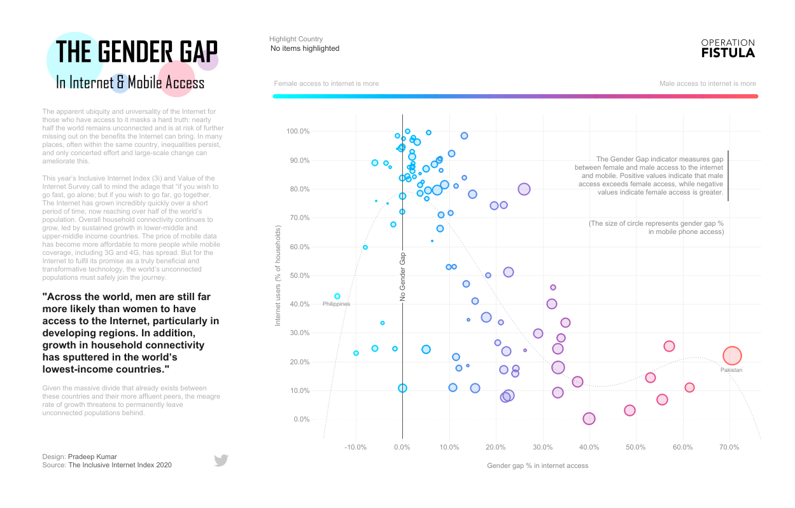

# Introducao

<!-- Escrever uma breve introducao sobre dashboard, de forma geral. Citar referencias. -->

# Referencial Teorico

Principais dashboards do mercado (tableau, power bi), mostrar exemplo, escrever descricao breve. mostrar alguns prints deles funcionando e suas diferencas.

>A dashboard is a visual display of data used to monitor conditions and/or facilitate understanding.

> This is a broad definition, and it means that we would consider all of the examples listed below to **dashboards**.
> - An interactive display that allows people to explore worker compensation claims by region, industry and body part.
> - A PDF showing key measures that gets e-mailed to an executive every monday morning.
> - A large wall-mounted screen that shows support center statistics in real time
> - A mobile application that allows sales managers to review performance across different regions and comparre year-to-date sales for the current year with the previous year.

> reference :book: The big book of dashboards, visualizing your data using real-world business scenarios.

## Power BI

Power BI is a cloud-based Self-Service Analytics platform from Microsoft. Its tool suite lets you mashup, visualize, analyze, and share data with ease.

Advantages:

- Power BI Desktop is free to install and use;
- Documentation with great support for beginners;
- Very similar to excel and office 365;

## Tableau

Tableau offers a highly interactive and intuitive visual-based exploration experience enabling business users to easily access, prepare and analyze their data. Tableau is considered the gold standard for intuitive interactive visual analytics.

# Material e metodos :book:

<!-- Colocar os diagramas, falar sobre as tecnologias. -->

A JavaScript library for building user interfaces.

## React

React makes it painless to create interactive UIs. Design simple views for each state in your application, and React will efficiently update and render just the right components when your data changes.

Here's the main libraries used to build a dashboard in react.

- react-router-dom: to manage the routes inside the webapp;
- material-ui: react components for faster and easier web development;
- react-flippy: to flip cards in react show kpi number vs kpi chart;
- react-markdown: to render markdown as pure react components and build the blog application;
- react-spinners: render some spinners while we load the API data;
- recharts: library used to composable charting built on react components;
- docker: to run the project locally;

# Cronograma de desenvolvimento

Levar em conta 4 meses de desenvolvimento para entrega da aplicacao.

- desenvolver backend
- desenvolver constantes
- desenvolver front-end
* listar as tarefas

epico, sprint, versao
