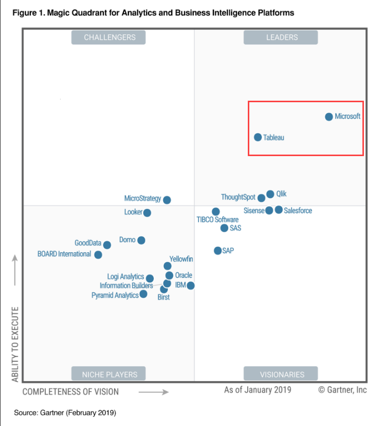
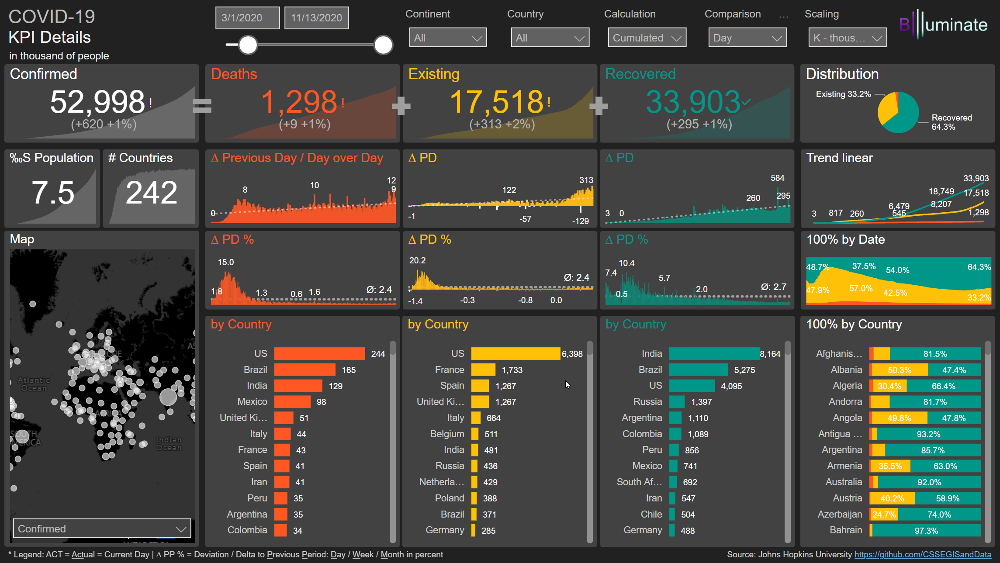
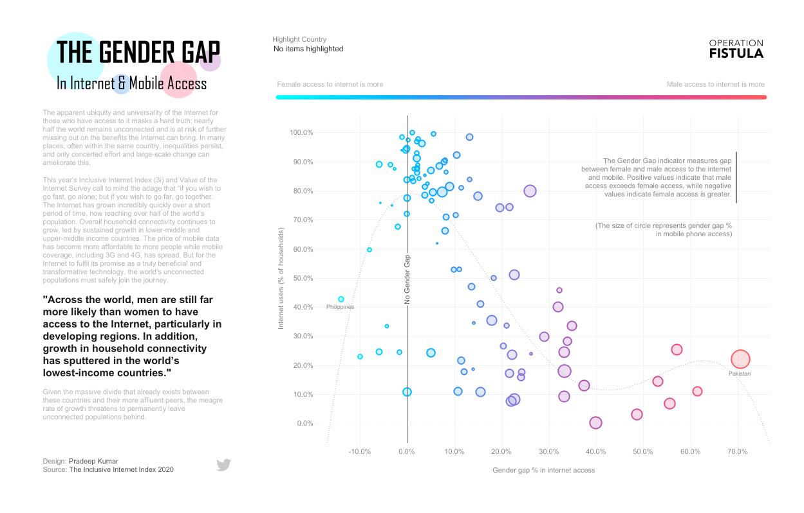
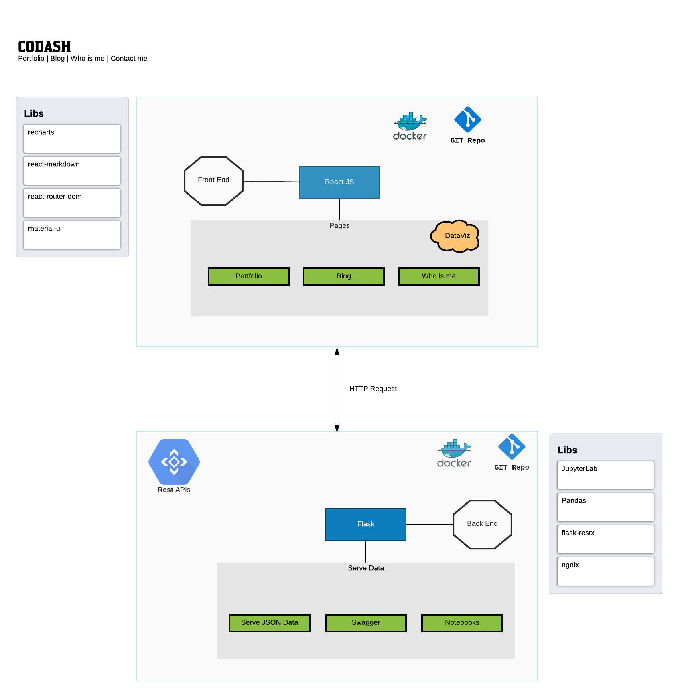
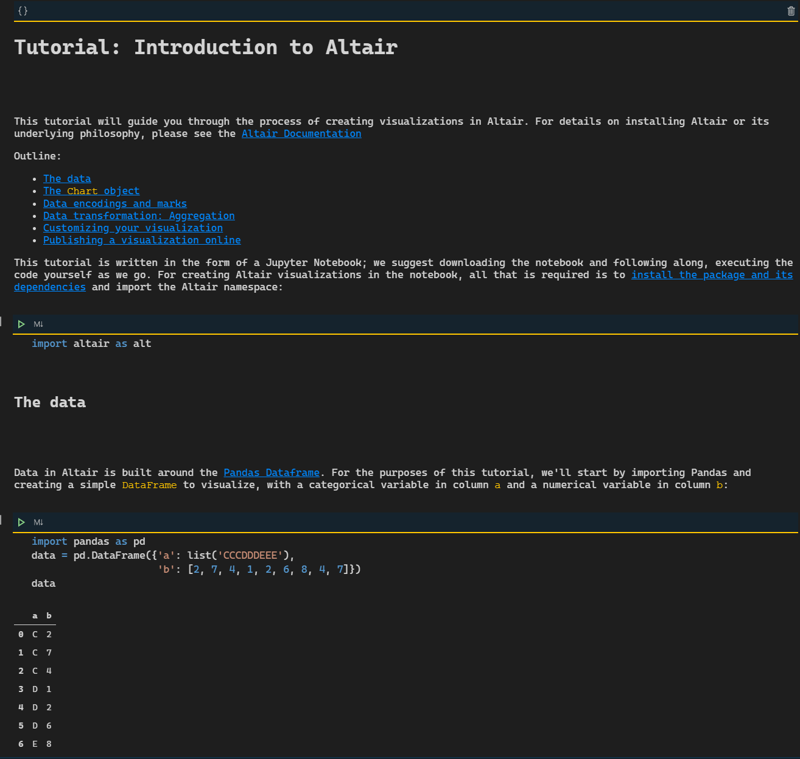
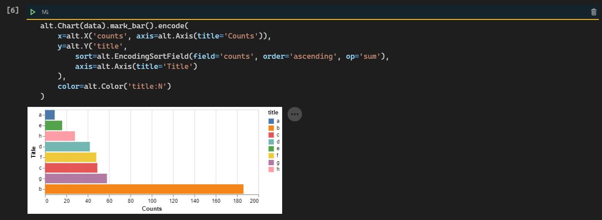
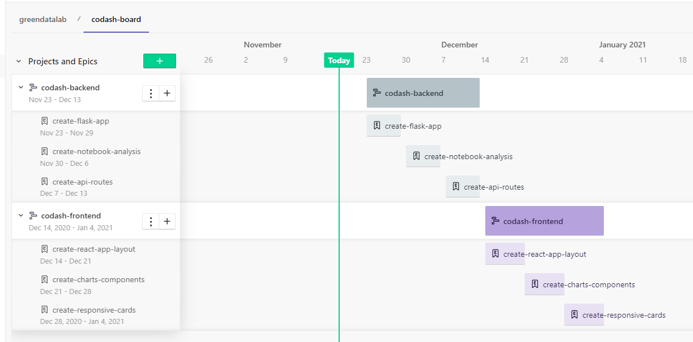

# Introducao

<!-- Escrever uma breve introducao sobre dashboard, de forma geral. Citar referencias. -->

/** O dashboard é uma aplicação de software que se propõe a entregar uma boa experiência de usuário para a audiência proposta. Neste caso, foi aplicado tecnologias open source, como, linguagens de programação Javascript e Python, docker para criação, teste e execução dos contâiners.

A aplicação proposta se propõe abertamente a ser uma alternativa viável de desenvolvimento de produtos de dados para desenvolvedores (O autor considera qualquer pessoa que tenha um conhecimento mínimo de lógica, que seja capaz de escrever fórmulas condicionais e de agregação no Excel como seja um desenvolvenvolvedor em potencial).
**/

The dashboard is a software application that aims to deliver a good user experience for the proposed audience. In this case, open source technologies were applied, such as Javascript and Python programming languages, docker for creating, testing and executing the containers.

The proposed application openly proposes to be a viable alternative for developing data products and target this solution to developers (The author considers anyone who has a minimum knowledge of logic, who is able to write conditional and aggregation formulas in Excel as a developer in potential).

>A dashboard is a visual display of data used to monitor conditions and/or facilitate understanding.

> This is a broad definition, and it means that we would consider all of the examples listed below to **dashboards**.
> - An interactive display that allows people to explore worker compensation claims by region, industry and body part.
> - A PDF showing key measures that gets e-mailed to an executive every monday morning.
> - A large wall-mounted screen that shows support center statistics in real time
> - A mobile application that allows sales managers to review performance across different regions and comparre year-to-date sales for the current year with the previous year.

> reference :book: The big book of dashboards, visualizing your data using real-world business scenarios.

# Referencial Teorico

Principais dashboards do mercado (tableau, power bi), mostrar exemplo, escrever descricao breve. mostrar alguns prints deles funcionando e suas diferencas.

Na atualiadade temos diversas aplicações que se propôe a criar uma experiência de usuário que facilite para pessoas não técnicas desenvolverem seus reports e dashboards de maneira mais intuitiva e rápida, isso de fato é muito bom, pois permite com que estes usuários não técnicos consigam importar, transformar, agregar, modificar, sumarizar, adequar seus dados e além disso tudo provê uma visualização de dados através de gráficos, tabelas, formas, cores e através de uma análise promover insights para suportar a tomada de decisão dos negócios, visão operacional e gerencial de operações para gerentes e supervisores, quadro financeiro e P&L financeiro para diretores, executivos, fornecedores, dentre outros interessados.

Iremos abordar logo abaixo as principais ferramentas do mercado, elegidos pelo quadrante mágico de gartner Microsoft com o Power BI e também o Tableau.

## Power BI

Power BI is a cloud-based Self-Service Analytics platform from Microsoft. Its tool suite lets you mashup, visualize, analyze, and share data with ease.

Advantages:

- Power BI Desktop is free to install and use;
- Documentation with great support for beginners;
- Very similar to excel and office 365;

## Tableau

Tableau offers a highly interactive and intuitive visual-based exploration experience enabling business users to easily access, prepare and analyze their data. Tableau is considered the gold standard for intuitive interactive visual analytics.

# Material e metodos :book:

<!-- Colocar os diagramas, falar sobre as tecnologias. -->

A JavaScript library for building user interfaces.

## Front-end

### React

React makes it painless to create interactive UIs. Design simple views for each state in your application, and React will efficiently update and render just the right components when your data changes.

Here's the main libraries used to build a dashboard in react.

- react-router-dom: to manage the routes inside the webapp;
- material-ui: react components for faster and easier web development;
- react-flippy: to flip cards in react show kpi number vs kpi chart;
- react-markdown: to render markdown as pure react components and build the blog application;
- react-spinners: render some spinners while we load the API data;
- recharts: library used to composable charting built on react components;
- docker: to run the project locally;

## Back-end

### Flask

Flask is very convinient to use in this solution because it has a very minimal setup and you can simply add only the libraries you should use in order to extract, transform and serve the data to front-end.

### JupyterLab

This is the perfect tool to write your notebooks and visualize the data using python, pandas and some viz libraries like Altair-Viz.

### Altair Viz

Altair is a declarative statistical visualization library for Python, based on Vega and Vega-Lite, and the source is available on GitHub.

With Altair, you can spend more time understanding your data and its meaning. Altair’s API is simple, friendly and consistent and built on top of the powerful Vega-Lite visualization grammar. This elegant simplicity produces beautiful and effective visualizations with a minimal amount of code.

# Agile sprints / Version 1 - cronograma

It was defined in our version planning that each epic will be solved in a single sprint of a week, separated into two projects, one for the Backend and one for the front end, proposing the following epics and development period.

## Codash Back-end

Epics/Sprints:
- create flask app // layout -> period: Nov 23 - Nov 29
- create notebook for data exploration -> period: Nov 30 - Dec 6
- create api routes -> period: Dec 7 - Dec 13

## Codash Front-End

Epicos/Sprints:
- create react app // layout -> period: Dec 14 - Dec 21
- create charts components -> period: Dec 21 - Dec 28
- create responsive cards -> period: Dec 28, 2020 - Jan 4, 2021

